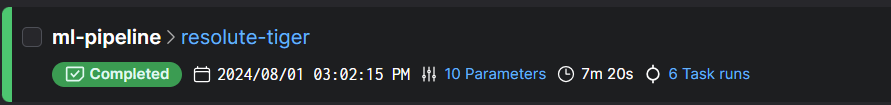

# Fuel Price Prediction

## Project Description
This is the implementation of my project for the course mlops-zoomcamp from [DataTalksClub](https://github.com/DataTalksClub/mlops-zoomcamp).
The goal of this project is to build an end-to-end machine learning pipeline to forecast the fuel price in a particular filling station in Germany. The main focus of the project is on creating a production service with experiment tracking, pipeline automation, and observability.

## Problem Statement
Due to geopolitical issues and recent rise in inflation, the fuel prices have increased. However, the fuel prices of filling stations in most countries fluctuates at different times in a day. Being able to predict these prices, could help an individual to ascertain the right time to get the cheapest fuel prices in a particular filling station either during a day, week or timeframe of interest. This will lead to savings for the individual. As a example, only one particular filing station in one particular location will be considered. 

## Dataset
The dataset used for this project has been sourced from the [Tankerkoenig](https://dev.azure.com/tankerkoenig/_git/tankerkoenig-data) Azure Repository.

## Project details
This repository has four folders: *src*, *notebooks*, *models*, and *data*.
- The `data` folder contains the dataset for the project and the code used to generate the data. Here only data for 2024 (01-01-2024 to 21-07-2024). The fuel price data for 2024 was downloaded from [Tankerkoenig](https://dev.azure.com/tankerkoenig/_git/tankerkoenig-data), preprocessed by using the script `prepare_data.py` in `src` and saved as `2024_globus_gas_prices.parquet`. Please, note that due the large size of the original raw data for 2024, the dataset was not committed to GitHub (see the `.gitignore` file). Nevertheles, you can download the 2024 data from [Tankerkoenig](https://dev.azure.com/tankerkoenig/_git/tankerkoenig-data).
- The `notebooks` folder contains Jupyter notebooks used for exploratory data analysis (EDA).
- The `src` folder contains the source code for the project.

## Additional files
- **requirements.txt**
  - Lists all the Python dependencies required for the project.
- **Dockerfile**
  - Defines the Docker image for the project, specifying the environment and dependencies required to run the code.

## Implementation Details

**1. Experiment Tracking and Model Registry**:
- **[MLflow](https://mlflow.org/)** is used to track experiments, including hyperparameters, metrics, and artifacts.
- Trained models are registered in the MLflow Model Registry.
- For this project, experiment tracking and a model registry has been implemented. Please refer to the `src` folder to find the folders `mlruns` and the `mlflow.db` database. Within folder `src`, the experiment tracking is done in `train.py` and the model registeration in the MLflow server is done in `model_registry.py`.


**2. Workflow Orchestration**:

**[Prefect](https://www.prefect.io/)** is used to create and manage the entire ML pipeline.
The pipeline includes data ingestion, preprocessing, feature engineering, model training, and evaluation steps.

First you need to use the `prefect cloud login` CLI command to log in to Prefect Cloud from your development environment (Virtual Studio Code was used for this project), and follow the instructions given in [Prefect Quickstart](https://docs.prefect.io/latest/getting-started/quickstart/).

```bash
prefect cloud login
```

and run:

```bash
python src/workflow.py
```



**Prefect Workflow Deployment**

To deploy the Prefect workflow, **please, run all the following commands in project root directory**: `fuel-price-prediction-mlops`.

First, we build the "Deployment" by providing the file and flow function names. A tag "dev" is also added to the Deployment. 

Now, we run run:

```bash
prefect deployment build src/workflow.py:ml_pipeline -n 'ml_pipeline_fuel_price' -a --tag dev
```


Next, we go to a new terminal and start a Prefect agent which is responsible for monitoring work pool from the 'default' work queue like so:

```bash
prefect agent start -q 'default'
```


Next, we go into another new terminal and run the deployment:

```bash
prefect deployment run 'ml-pipeline/ml_pipeline_fuel_price'
```


Finally, you can view your deployment in the Prefect Cloud UI by logging in.


**3. Model Deployment**:
First, we move into the `web-service` folder:

```bash
cd web-service
```

Here, we use `pipenv` (see `requirements.txt` file) to create a virtual environment. Since `torch` was used to train the model, ensure you ascertain the version of `torch` and the version of `Python` that was used. 

```bash
pip freeze | grep torch
```
which is `torch==2.3.1`

```bash
$ python --version
```

which is `Python 3.11.7`

Next, we set-up the virtual environment with `pipenv` and install the correct versions of `torch`, `flask` and `python` within that virtual environment.

```bash
pipenv install torch==2.3.1 flask --python=3.11
```

Next,

```bash
pipenv shell
```

Currently, we are running in dev mode. To run in production mode, there are different options.

For Linux/Unix-like systems, run:

```bash
pipenv install gunicorn
```

Next, run:

```bash
gunicorn --bind=0.0.0.0:9696 predict:app
```

For Windows systems, run:

```bash
pipenv install waitress
```

Next, run:

```bash
waitress-serve --listen=*:9696 predict:app
```

**Docker**

The web service deployment code is containerized and could be deployed to the cloud. Here, we use python:3.11-slim in the Dockerfile (see [Docker Hub](https://hub.docker.com/_/python/)). The final Dockerfile can be found in `web-service\Dockerfile`.

Given that the Dockerfile in located in the `web-service` folder and the model is stored in the `models` folder, **we run need to build the Docker container from the parent directory of the project** `fuel-price-prediction-mlops` by executing the following command in the terminal:

```bash
docker build -t fuel-price-prediction-service:v1 -f web-service/Dockerfile .
```

To run the Docker container, we run:

```bash
docker run -it --rm -p 9696:9696 fuel-price-prediction-service:v1
```

**Note**: the `ENTRYPOINT` can be defined with either `waitress-serve` OR `gunicorn`

`ENTRYPOINT [ "waitress-serve", "--listen=*:9696", "predict:app" ]`

OR

`ENTRYPOINT [ "gunicorn", "--bind=0.0.0.0:9696", "predict:app" ]`


**4. Model Monitoring**:

**5. Reproducibility**:
- Detailed instructions are below to explain how to set up the environment and run the code.
- All dependencies and their versions are specified in `requirements.txt`.


---
