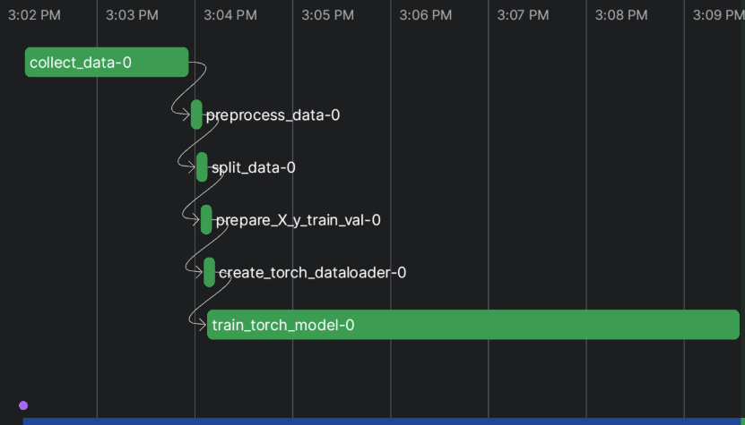
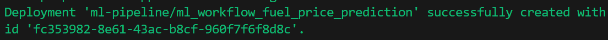
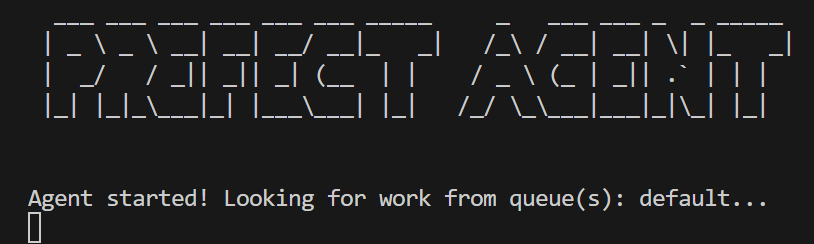
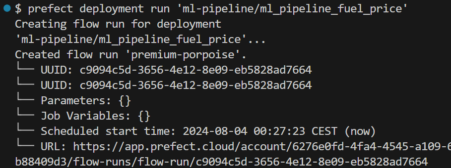
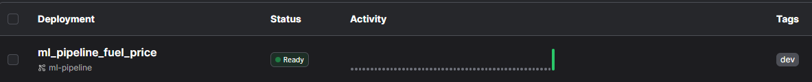
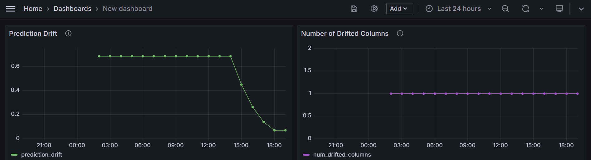

# Fuel Price Prediction

## Project Description
This is the implementation of my project for the course mlops-zoomcamp from [DataTalksClub](https://github.com/DataTalksClub/mlops-zoomcamp).
The goal of this project is to build an end-to-end machine learning pipeline to forecast the fuel price in a particular filling station in Germany. The main focus of the project is on creating a production service with experiment tracking, pipeline automation, and observability.

## Problem Statement
Due to geopolitical issues and recent rise in inflation, the fuel prices have increased. However, the fuel prices of filling stations in most countries fluctuates at different times in a day. Being able to predict these prices, could help an individual to ascertain the right time to get the cheapest fuel prices in a particular filling station either during a day, week or timeframe of interest. This will lead to savings for the individual. As a example, only one particular filing station in one particular location will be considered.

## Dataset
The dataset used for this project has been sourced from the [Tankerkoenig](https://dev.azure.com/tankerkoenig/_git/tankerkoenig-data) Azure Repository.

## Project Details
This repository has four folders: *src*, *notebooks*, *models*, and *data*.
- The `data` folder contains the dataset for the project and the code used to generate the data. Here only data for 2024 (01-01-2024 to 21-07-2024). The fuel price data for 2024 was downloaded from [Tankerkoenig](https://dev.azure.com/tankerkoenig/_git/tankerkoenig-data), preprocessed by using the script `prepare_data.py` in `src` and saved as `2024_globus_gas_prices.parquet`. Please, note that due the large size of the original raw data for 2024, the dataset was not committed to GitHub (see the `.gitignore` file). Nevertheles, you can download the 2024 data from [Tankerkoenig](https://dev.azure.com/tankerkoenig/_git/tankerkoenig-data).
- The `notebooks` folder contains Jupyter notebooks used for exploratory data analysis (EDA).
- The `src` folder contains the source code for the project.

## Additional Files
- **requirements.txt**
  - Lists all the Python dependencies required for the project.
- **Dockerfile**
  - Defines the Docker image for the project, specifying the environment and dependencies required to run the code.


## **Quick Start**
To get started with this project, do the following in the terminal:

```bash
git clone https://github.com/victornemenike/fuel-price-prediction-mlops.git
```

## Implementation Details

### **1. Experiment Tracking and Model Registry**:
- **[MLflow](https://mlflow.org/)** is used to track experiments, including hyperparameters, metrics, and artifacts.
- Trained models are registered in the MLflow Model Registry.
- For this project, experiment tracking and a model registry has been implemented. Please refer to the `src` folder to find the folders `mlruns` and the `mlflow.db` database. Within folder `src`, the experiment tracking is done in `train.py` and the model registeration in the MLflow server is done in `model_registry.py`.

To run the MLflow server locally, simply go to the project root directory and type:

```bash
mlflow ui --backend-store-uri=sqlite:///mlflow.db
```
with is identical to:

```bash
mlflow ui --backend-store-uri sqlite:///mlflow.db
```


```bash
mlflow server --backend-store-uri=sqlite:///mlflow.db --default-artifact-root={model-location}
```

`model-location` could be an S3 bucket. For example, `s3://mlflow-models-victor`. It could also be locally, for example `LSTM-model`.

### **2. Workflow Orchestration**:

**[Prefect](https://www.prefect.io/)** is used to create and manage the entire ML pipeline.
The pipeline includes data ingestion, preprocessing, feature engineering, model training, and evaluation steps.

First you need to use the `prefect cloud login` CLI command to log in to Prefect Cloud from your development environment (Virtual Studio Code was used for this project), and follow the instructions given in [Prefect Quickstart](https://docs.prefect.io/latest/getting-started/quickstart/).

```bash
prefect cloud login
```

and run:

```bash
python src/workflow.py
```


**Prefect Workflow Deployment**

To deploy the Prefect workflow, **please, run all the following commands in project root directory**: `fuel-price-prediction-mlops`.

First, we build the "Deployment" by providing the file and flow function names. A tag "dev" is also added to the Deployment.

Now, we run run:

```bash
prefect deployment build src/workflow.py:ml_pipeline -n 'ml_pipeline_fuel_price' -a --tag dev
```


Next, we go to a new terminal and start a Prefect agent which is responsible for monitoring work pool from the 'default' work queue like so:

```bash
prefect agent start -q 'default'
```


Next, we go into another new terminal and run the deployment:

```bash
prefect deployment run 'ml-pipeline/ml_pipeline_fuel_price'
```



Finally, you can view your deployment in the Prefect Cloud UI by logging in.




### **3. Model Deployment**:

The web service deployment code is containerized and could be deployed to the cloud. Here, we use python:3.11-slim in the Dockerfile (see [Docker Hub](https://hub.docker.com/_/python/)). The final Dockerfile can be found in `web-service\Dockerfile`.

**Note**: the `ENTRYPOINT` in the `Dockerfile` can be defined with either `waitress-serve` OR `gunicorn`

`ENTRYPOINT [ "waitress-serve", "--listen=*:9696", "predict:app" ]`

OR

`ENTRYPOINT [ "gunicorn", "--bind=0.0.0.0:9696", "predict:app" ]`

Given that the Dockerfile in located in the `web-service` folder and the model is stored in the `models` folder, **we need to build the Docker container from the parent directory of the project** `fuel-price-prediction-mlops` by executing the following command in the terminal:

```bash
docker build -t fuel-price-prediction-service:v1 -f web-service/Dockerfile .
```

To run the Docker container, we run:

```bash
docker run -it --rm -p 9696:9696 fuel-price-prediction-service:v1
```

Next, open a new tab within the same terminal, cd to the `web-service` directory like so:

```bash
cd web-service
```

 and run the following to test that the web service is indeed running in a Docker container:

```bash
python test_flask_app.py
```

### **4. Model Monitoring**:
 Navigate into the `monitoring` folder and run:

 ```bash
  docker-compose up --build
  ```

  Load MLflow in terminal like so:

  ```bash
  mlflow server --backend-store-uri sqlite:///mlflow.db
  ```

  To view the baseline model metrics via the Evidently UI, run the Jupyter notebook `baseline_model_monitoring.ipynb` and then run the following via the terminal:

  ```bash
  evidently ui
  ```

  If running on localhost, visit: `http://localhost:8000` and not `http://0.0.0.0:8000`.

  To monitor the model performance via Grafana, simply run the following via the terminal:

  ```bash
  python evidently_metrics_calculation.py
  ```

  and then login to the Grafana Dashboard via the local host: `localhost:3000/`

  

  ### **Generating debugging dashboard when threshold is violated**

  To debug the model metrics with Evidently, run the notebook `debugging_fuel_price_data.ipynb`. _Note that here, the only column that drifts in the `timestamp` column. This makes sence, since we are dealing with time series data._

### **5. Best Practices**:
- [x] **Unit Tests**
```bash
cd tests
```

```bash
 pytest unit_tests/
```

- [x] **Integration Tests**

We run an integration test for web service deployment using the Dockerfile. To do that, simply do the following for the parent directory of the project:

```bash
cd tests/integration_tests
```

Next, build the Docker image:

```bash
docker build -t fuel-price-prediction-service:test .
```

and then run the Docker image:

```bash
docker run -it --rm -p 8080:8080 fuel-price-prediction-service:test
```

Next, create another tab in the same terminal and run:

```bash
 python .\test_docker.py
```

Alternatively, if you have administrative permissions and you are using a Bash shell, you could simply run the following in-lieu of the previous steps above:

```bash
./run.sh
```

For the `run.sh` bash script to work, you have to ensure that the port 8080 is available on your host machine.

- [x] **Linting and Code formating**

 For linting and code formating the packages `Pylint`, `black` and `isort` were used. The configurations for these packages are set in the file: `pyproject.toml`.

For linting, we use `Pylint` and run the following in the project's parent directory:

```bash
pylint --recursive=y .
```

For formatting, the package `black` was used to remove white spaces and ensure consistent styling in each folder. First, we check the changes that would be made by black by running:

```bash
black --skip-string-normalization --diff . | less
```

If we are satisfied, we simply run the following:

```bash
black .
```
**Note: after this, it is advised to check the changes made by `black`, by doing
```bash
git diff <filename>
```

If all is fine, we proceed. Otherwise, we revert back to the most stable Git commit.

The package `isort` was used for arranging the import statements:

```bash
isort --diff . | less
```

```bash
isort .
```

Next, you could run the following in a Bash terminal to check if linting check will fail before a pre-commit in GitHub:
```bash
$ echo $?
```

- [x] **Pre-commit hooks**

Git hooks are especially useful to ensure that your code passes some quality checks before it is committed. For this project, the [pre-commit](https://pre-commit.com/) package is used for these hooks. The pre-commit configurations for this project can be found in the yaml file: `.pre-commit-config.yaml`. To use pre-commit hooks, simply follow these steps:

```bash
pre-commit install
```
You can optionally run:
```bash
pre-commit run --all-files
```

Next, you can stage and commit files are usual and the file will be taken through the pre-commit sequence. For example:

```bash
git add src/train.py
```

```bash
git commit -m 'fixes from precommit hooks for src/train'
```

### **6. Reproducibility**:
- Detailed instructions on how to set up the environment and run the code are already explained in the sections
- All dependencies and their versions are specified in `requirements.txt`.

---
